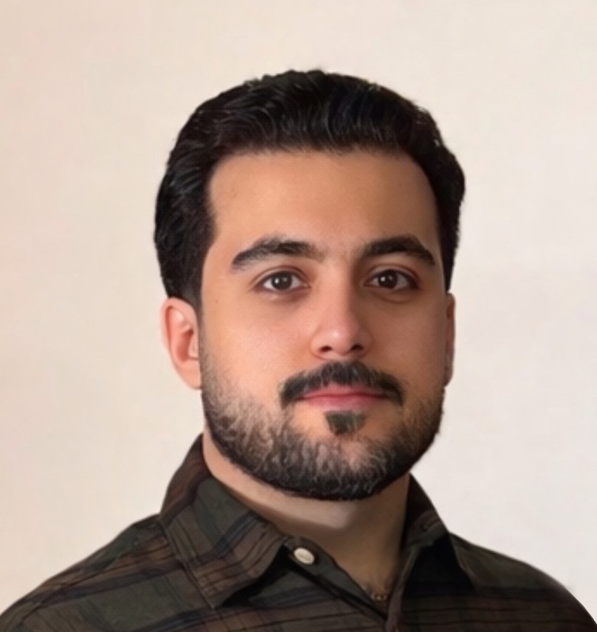

  

    
    <h2>Amirhossein Zeinali</h2>
    
<strong>IT Support | Cybersecurity | Cloud</strong>

    
📍 Thunder Bay, ON

    
📧 <a href="mailto:amirhosseinzeinali2@gmail.com">amirhosseinzeinali2@gmail.com</a>

    
🔗 <a href="https://github.com/azeinali22">GitHub</a>

    
📄 <a href="CV.pdf">Download Resume</a>

  

  

    <h2>Summary</h2>
    

      IT professional with experience in technical support, system administration,
      and cybersecurity. Strong background in troubleshooting, documentation,
      and enterprise IT environments.
    

    <h2>Experience</h2>
    
<strong>IT Help Desk Technician</strong> — Dilico Anishinabek Family Care

    <ul>
      <li>Provided Tier 1–2 technical support across enterprise environments</li>
      <li>Managed endpoints, user accounts, and troubleshooting tasks</li>
      <li>Supported Microsoft 365, Active Directory, and networking tasks</li>
    </ul>

    <h2>Skills</h2>
    <ul>
      <li>Windows / Microsoft 365</li>
      <li>Active Directory & Azure AD</li>
      <li>Help Desk & Ticketing Systems</li>
      <li>Networking & Troubleshooting</li>
    </ul>
  

